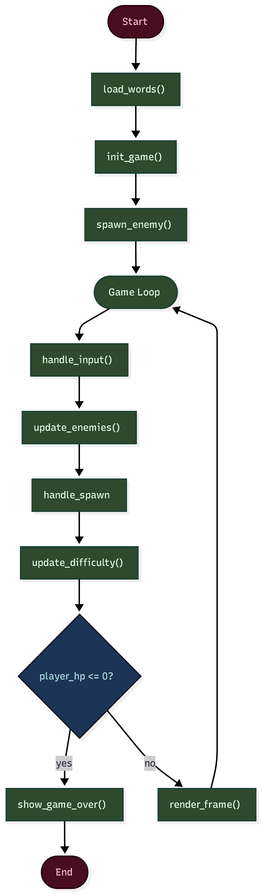
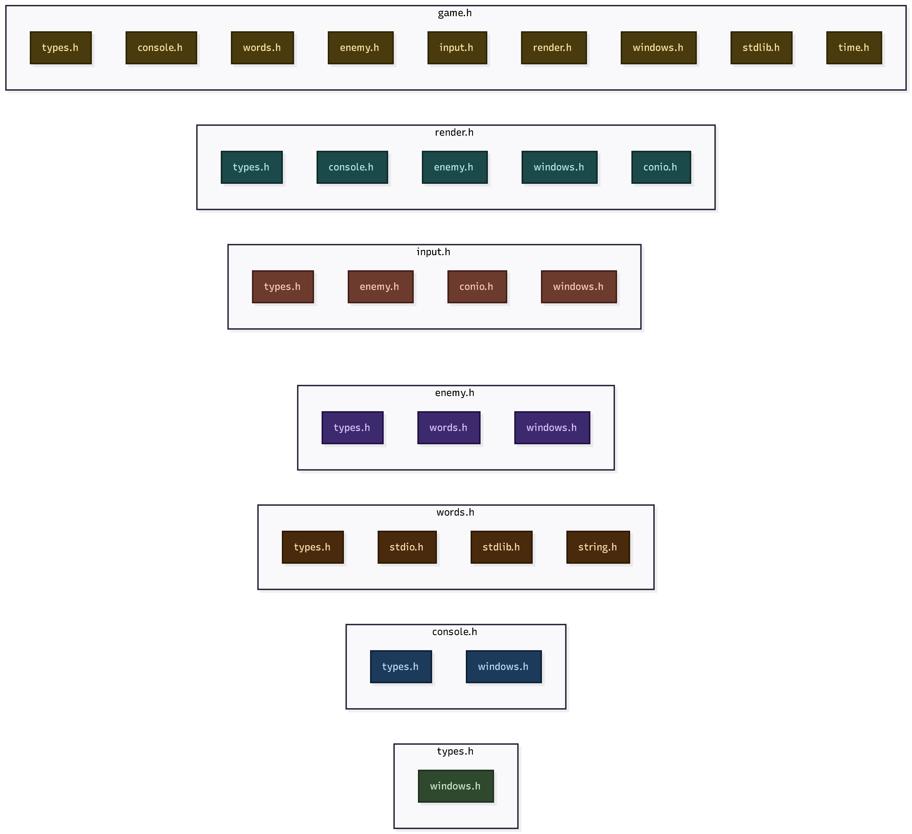
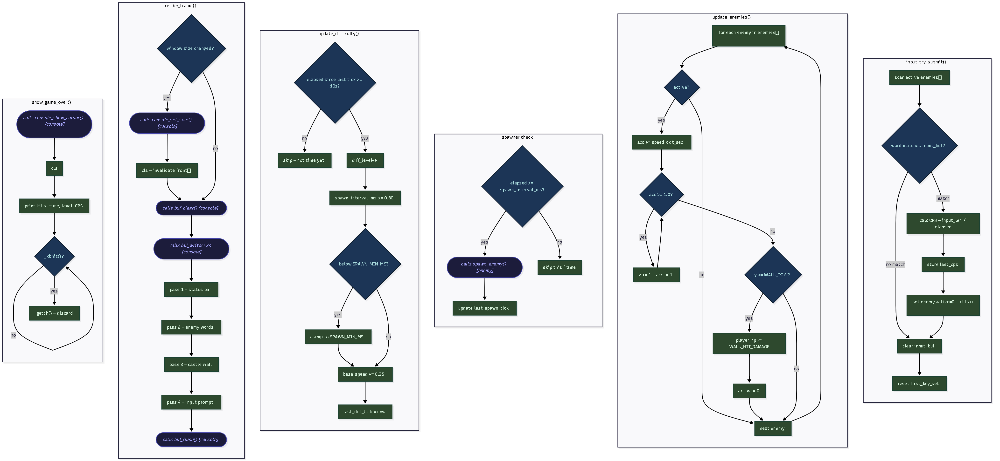
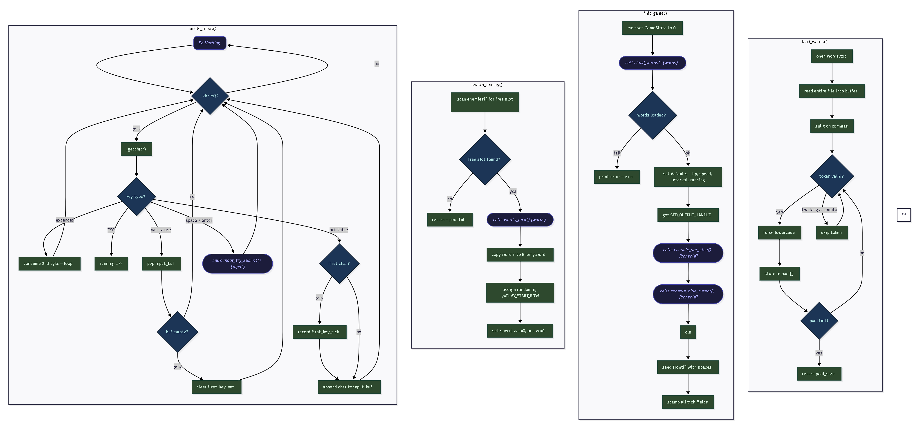

# C programming Project
---
## Docs
1. [TODOs](./docs/TODO.md)
2. [Flowcharts](./docs/flowcharts/img/)

## System Designs

#### 1. Main Flow

#### 2. Include Dependencies

#### 3. Sub systems Workings

## Team Members
1. Mahendra Sharma `082BCT037`
2. Aliz Bhattarai `082BCT008`
3. Abhishek Thagunna `082BCT007`
4. Binod Kafle `082BCT020`

